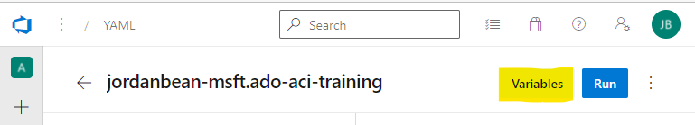

# ado-aci-training

This repo shows you how to set up an Azure DevOps (ADO) pipeline that deploys ADO [self-hosted build agents](https://docs.microsoft.com/en-us/azure/devops/pipelines/agents/docker?view=azure-devops) to Azure Container Instance (ACI). This allows you to host multiple build agents in your own subscription for parallel build/deployments or to have access to a vNet you control. The ADO build agents are running on each container in the container group and will regularly ping Azure DevOps listening for work.


## Disclaimer

**THE SOFTWARE IS PROVIDED "AS IS", WITHOUT WARRANTY OF ANY KIND, EXPRESS OR IMPLIED, INCLUDING BUT NOT LIMITED TO THE WARRANTIES OF MERCHANTABILITY, FITNESS FOR A PARTICULAR PURPOSE AND NONINFRINGEMENT. IN NO EVENT SHALL THE AUTHORS OR COPYRIGHT HOLDERS BE LIABLE FOR ANY CLAIM, DAMAGES OR OTHER LIABILITY, WHETHER IN AN ACTION OF CONTRACT, TORT OR OTHERWISE, ARISING FROM, OUT OF OR IN CONNECTION WITH THE SOFTWARE OR THE USE OR OTHER DEALINGS IN THE SOFTWARE.**

## Deployment

0.  Create an [Azure Resource Group](https://docs.microsoft.com/en-us/azure/azure-resource-manager/management/manage-resource-groups-portal) to own your self-hosted build agents.

0.  Update the `/ado/env/central.yml` file with the name of your resource group.

    ```yaml
    centralResourceGroupName: rg-adoAci-ussc-central
    ```

0.  Create a [service connection](https://docs.microsoft.com/en-us/azure/devops/pipelines/library/connect-to-azure?view=azure-devops) to your Azure subscription or resource group.

0.  Update the `/ado/env/global.yml` file with the name of your service connection.

    ```yaml
    serviceConnectionName: jordanbean-aia
    ```

0.  Create an [agent pool](https://docs.microsoft.com/en-us/azure/devops/pipelines/agents/pools-queues?view=azure-devops&tabs=yaml%2Cbrowser) to allow your self-hosted ADO build agents to be used by other pipelines.

    

0.  Update the `/ado/env/global.yml` file with the name you select for your ADO agent pool

    ```yaml
    adoAgentPoolName: adoAciPool
    ```

0.  Create an [environment](https://docs.microsoft.com/en-us/azure/devops/pipelines/process/environments?view=azure-devops) for each resource group you are going to deploy to. Note that this is only 1 way to organize environments; you can organize any way you want. Environments are typically used to control things like approvals. So you could make an environment for dev, test, prod, etc. in a real deployment.

    

0.  Update the `/ado/env/central.yml` with the name of the environment you created.

    ```yaml
    centralEnvironmentName: central
    ```

0.  Update the other variables in the `/ado/env/central.yml` file so they reference your environment.

    ```yaml
    adoUrl: https://dev.azure.com/jordanbean-msft-demo-org
    appName: adoAci
    location: ussc
    subscriptionId: dcf66641-6312-4ee1-b296-723bb0a999ba
    tenantId: 72f988bf-86f1-41af-91ab-2d7cd011db47
    ```

0.  Generate a [Personal Access Token](https://docs.microsoft.com/en-us/azure/devops/organizations/accounts/use-personal-access-tokens-to-authenticate?view=azure-devops&tabs=preview-page) (PAT) for your self-hosted ADO agents to use to authenticate to Azure DevOps. Note that in a real production environment, you should generate this PAT by logging into ADO with a service account, not a personal development account. You will need to give the PAT **Agent Pools (Read & manage)** and **Deployment Groups (Read & manage)** scopes (click **Show all scopes** if can't see these). Copy this PAT to Notepad for later.

0.  Create a new ADO YAML pipeline. Select your repo & then select **Existing Azure Pipelines YAML file**. Then select the `/ado/infra/central/azure-pipeline.yml` file as the existing YAML file.

    

0.  Add a pipeline variable. Name it **azpToken** and copy the PAT you generated before into the **value**. Make sure and check the **Keep this value secret** so the password is never exposed.

    

    

    You do not want to check the PAT into source control since it is a password, so this is a logical place to store this value (you can also use a variable group or Azure KeyVault).

0.  Save & run your pipeline. If everything succeeds you should see a single stage, single job & several tasks.

    

    The first time you run it, you may have to authorize it to use the environment & agent pool.

    

    You can then see these agents in the ADO agent pool.
    
    

    You can also see the underlying infrastructure in the Azure portal.

    

    Now, you can reference this new ADO agent pool in your future pipelines.

    ```yaml
    stages:
    - stage: Dev 
      jobs:
      - deployment: Dev
        pool:
          name: 'adoAciPool'
    ```

## Explanation of pipeline

This pipeline has 3 major stages:

- Deploy initial infrastructure. This includes an Azure Container Registry & Log Analytics
- Build the Docker image that contains the Azure DevOps build agent
- Deploy the Azure Container Instance that will host the ADO build agents

The entrypoint for the pipeline is the `/ado/infra/central/azure-pipeline.yml` file.


You can see that the pipeline pulls in some variables from files. These are variables we want to check into source control because they are not secrets & are the same for all runs (whereas the PAT that allows the ADO agents to authenticate with ADO is a secret and should not be checked into source control)

You can also see that this is a **deployment** job. You can deploy to Azure using YAML pipelines instead of classic Release pipelines. You can also see that this uses a Microsoft hosted build agent **ubuntu-latest**. This is to boot-strap the environment. After this pipeline runs, the self hosted agent pool you created will have multiple build agents available for other pipelines to use.

Finally, you can see the calls to the 3 deployment scripts.

In the `/ado/infra/central/ado-agents/dockeragent` directory, you can see the Dockerfile & startup script that the containers are built with. These are pulled from the Azure DevOps [documentation](https://docs.microsoft.com/en-us/azure/devops/pipelines/agents/docker?view=azure-devops#create-and-build-the-dockerfile-1). They are not built locally on the build agent when this pipeline runs, but are built inside the Azure Container Registry using the **az acr build** task (in the `/ado/global/build-image.yml` file).

You will also notice that ACI doesn't require a Docker Compose or Kubernetes object YAML files. You can use [YAML](https://docs.microsoft.com/en-us/azure/container-instances/container-instances-reference-yaml) if you want to to configure, but you can also do the configuration directly in the deployment [Bicep](https://docs.microsoft.com/en-us/azure/templates/microsoft.containerinstance/containergroups?tabs=bicep) file `/ado/infra/central/ado-agents/ado-build-agents/aci.bicep`.

## References

- [Quickstart - Build a container image on-demand in Azure - Azure Container Registry | Microsoft Docs](https://docs.microsoft.com/en-us/azure/container-registry/container-registry-quickstart-task-cli#build-and-push-image-from-a-dockerfile)
- [az acr | Microsoft Docs](https://docs.microsoft.com/en-us/cli/azure/acr?view=azure-cli-latest#az_acr_build)
- [Run a self-hosted agent in Docker - Azure Pipelines | Microsoft Docs](https://docs.microsoft.com/en-us/azure/devops/pipelines/agents/docker?view=azure-devops)
- [CI/CD with Azure Pipelines and Bicep files - Azure Resource Manager | Microsoft Docs](https://docs.microsoft.com/en-us/azure/azure-resource-manager/bicep/add-template-to-azure-pipelines)
- [Microsoft.ContainerInstance/containerGroups - Bicep & ARM template reference | Microsoft Docs](https://docs.microsoft.com/en-us/azure/templates/microsoft.containerinstance/containergroups?tabs=bicep#resourcerequests)
- [Resource availability by region - Azure Container Instances | Microsoft Docs](https://docs.microsoft.com/en-us/azure/container-instances/container-instances-region-availability)
- [Azure Resource Manager service connection](https://docs.microsoft.com/en-us/azure/devops/pipelines/library/connect-to-azure?view=azure-devops)
- [Agent pools](https://docs.microsoft.com/en-us/azure/devops/pipelines/agents/pools-queues?view=azure-devops&tabs=yaml%2Cbrowser)
- [Create and target an environment](https://docs.microsoft.com/en-us/azure/devops/pipelines/process/environments?view=azure-devops)
- [Manage Azure Resource groups](https://docs.microsoft.com/en-us/azure/azure-resource-manager/management/manage-resource-groups-portal)
- [Use personal access tokens](https://docs.microsoft.com/en-us/azure/devops/organizations/accounts/use-personal-access-tokens-to-authenticate?view=azure-devops&tabs=preview-page)
- [Create and build the Dockerfile](https://docs.microsoft.com/en-us/azure/devops/pipelines/agents/docker?view=azure-devops#create-and-build-the-dockerfile-1)
